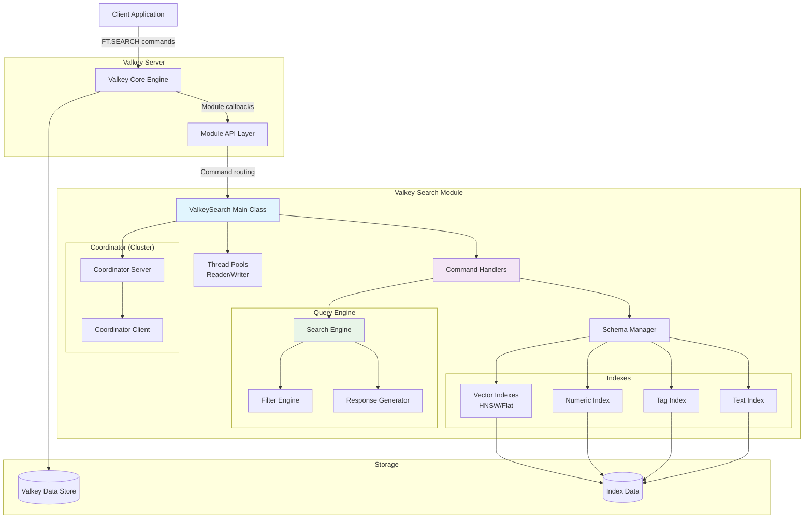
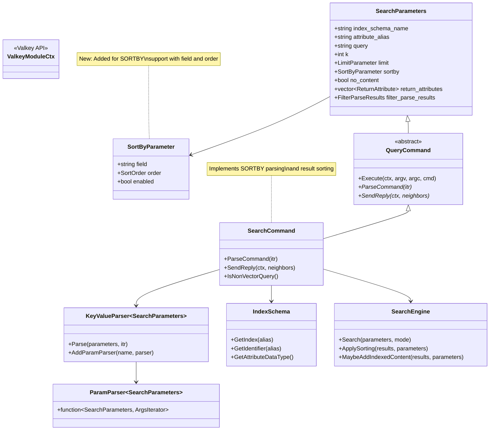
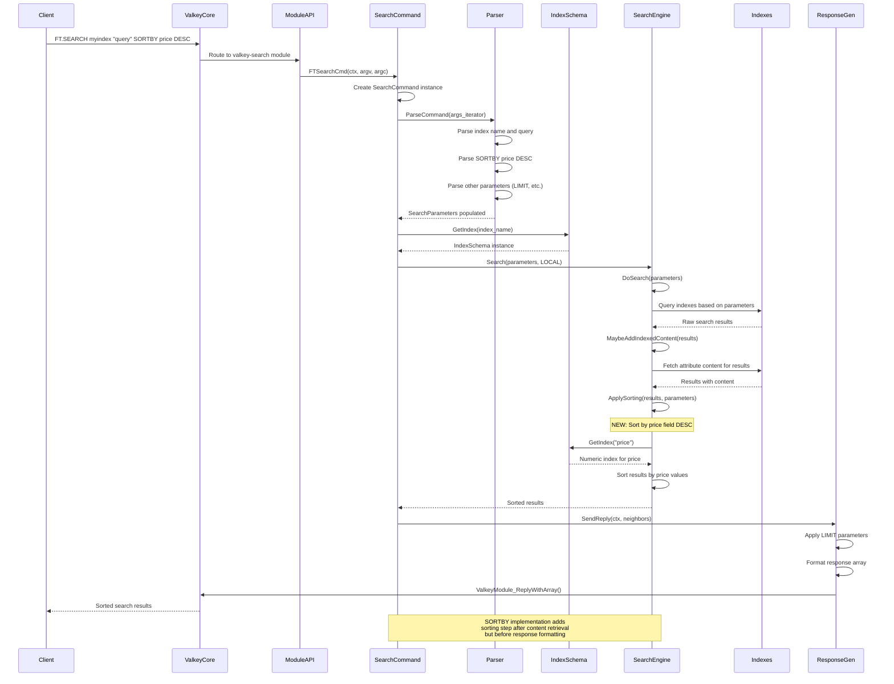

# Valkey-Search Architecture Diagrams

## 1. High-Level Architecture Diagram

## 2. Class Diagram - Command Implementation

## 3. Sequence Diagram - FT.SEARCH Command Flow

## Key Implementation Points

### SORTBY Integration:
1. **Parser Level**: Added `ConstructSortByParser()` to handle `SORTBY field [ASC|DESC]` syntax
2. **Data Structure**: Extended `SearchParameters` with `SortByParameter` 
3. **Execution**: Added `ApplySorting()` function called after content retrieval
4. **Validation**: Ensures sort field is indexed before attempting to sort

### Flow Characteristics:
- **Non-intrusive**: SORTBY doesn't affect search performance, only final result ordering
- **Type-aware**: Different sorting logic for numeric vs tag fields
- **Error-safe**: Graceful handling of missing values and unsupported field types
- **Compatible**: Works with existing LIMIT, RETURN, and other FT.SEARCH options
